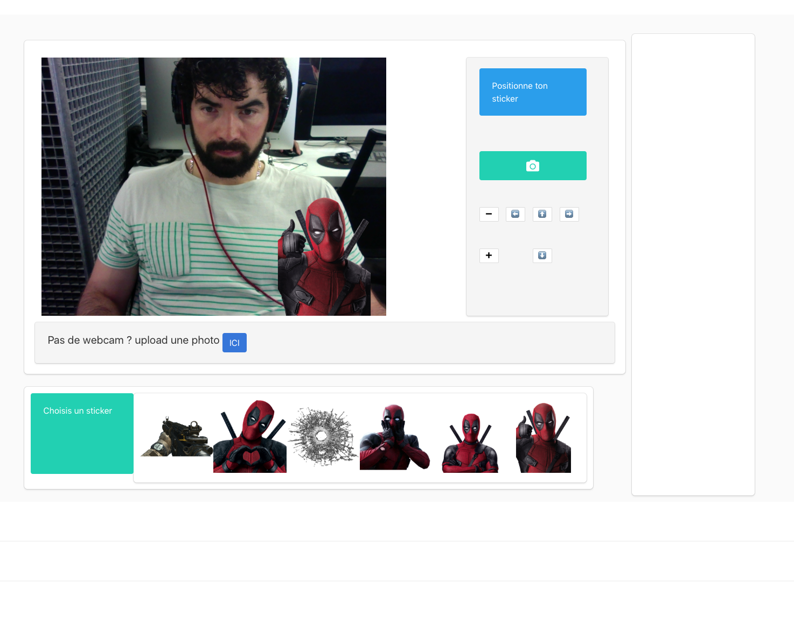
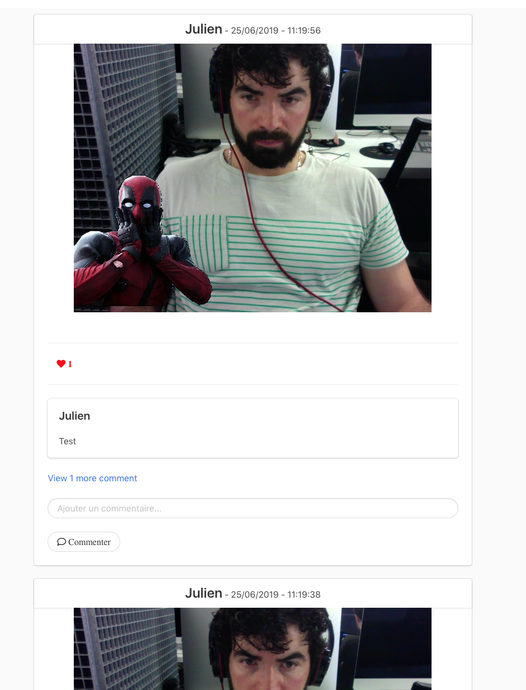
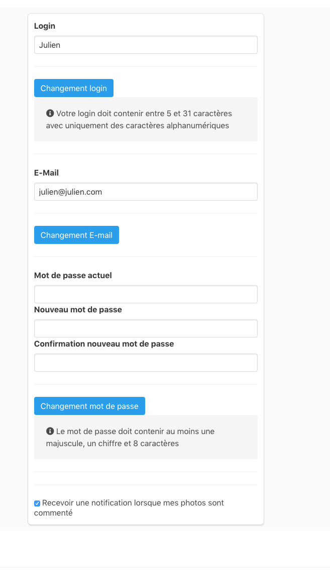

<h1>Camagru</h1>

42's first project in web development

<h2>Technology used</h2>
<li>MYSQL</li>
<li>PHP from scratch</li>
<li>JavaScript (front only)</li>
<li>HTML/CSS[bulma]</li>

<h1> Picture is worth a thousand words </h1>

</img>

</img>

</img>

<h1>Try it ?</h1>
<code>
Clone the repo inside MAMP/apache2/htdocs
</code>
<code>
Execute : "php config/setup.php"
</code>
